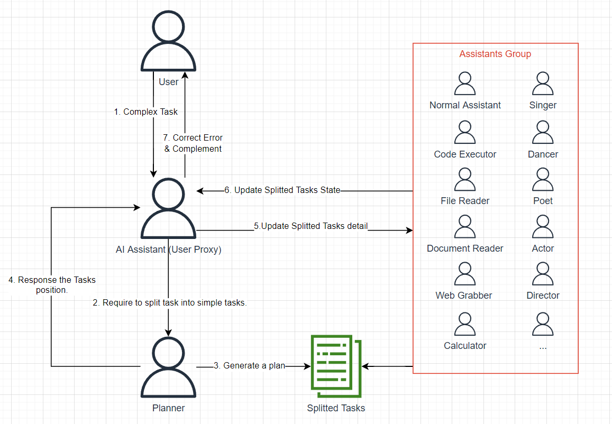

# *DO YOU NEED TO TALK WITH ATM？IF YES，IT IS QUICKER OR SLOWER？*

# First, Play the AnEasyAgentsInteraction.ipynb

In this notebook, you can learn that how to create Agent, how to use Agent. 

Do not mind if it is 'autogen' based, you can also write codes by yourself to make them interacting, and more free space to customize the flow. 

# Phases

- *Phase 1: Create Agent*

  No matter which type of Agent you want to create, just do it.
  
  A planner, some assistants, a supervisor, some executor, no matter, just create it.

  In this phase, you just need to agree that, Agent will bring intelligence to legacy object.

- *Phase 2: Evaluate*

  Maybe you have realize that, something is strange, of course, maybe not, no matter again.

  Think about the tranditional programming, sorry I call it tranditional programming, it means no AI init in this scene.

  In that type of programming or software engineering, we always try to find something can be reused, abstracted, deleted, cached.

  So how about this time, we reuse what? abstract what? delete what? cache what?

  We need to do some evaluation before we do those things. Which part needs to be evaluated?

  Do you remember this?

  

  we need to evaluate if step 3-6 were stable.

  Why? The reason is in the next Phase. Because in some project or produc, we just need to evaluate it and give some report to customer or to ourself, the work is done here. But, if your work is to intergrate systems or other agent, you need to step into next Phrases.

  - *Phase 3: Drop Agent(For Dynamic & Automatic Systems Integration)*

  Take an assumption: We have a lot of legacy systems, legacy endpoints, legacy APIs, new Agents. Then we got a new Customer Requirement to Create an API. After thinking and talking about the requirement, we found that we just need to combine some of we have, then we can complete the job.
  
  If we had done the upgradation from Legacy system to Agent, and stored the them into vector database or graph database, maybe call it *Features Store*? (Phase 1 job). We just need to ask *planner agent* to pick necessary features from Features Store then schedule plan or calling flow, then let *scripting agent* to generate some glue codes, then let *supervior agent* to summarize necessary data and collect it. (Phase 1 job)
  
  If we found it is being a stable(after evaluation) Multi-Agent. (Phase 2 job) When this API faces the same or similar request:

  Shall we call *planner agent* to schedule plan or calling flow again?

  Shall we let *scripting agent* to generate glue codes again?

  Shall we let *supervior agent* to summarize necessary data again?

  Probably not.

  I think we need to make the plan, calling flow, generated glue codes, input/output rule and so on, to be persistent.

  Then when we call this API again, API will have better performance and more stability.

  Because LLM, no matter which type of model, will cost a lot of calculating time then normal logic.
  
  Because LLM, no matter which type of model, has no 100 percents stability.

  It is not a good idea to bring in it into our system interation tasks.
  
  So I said in this section title, drop some LLM agents.

  - *Phase 4: Iteration and Improvement*
 
  This phase it not difficult. The last phase, phase 3, is just talking about to create one API. If we do more and more interation works, the created APIs could also to be a new Agent, also to be stored into Features Store. We could build a super huge features store with our existing features, included human created features and AI created features. But, the important thing is that, all features in Features Store have no LLM or model (unless this is originally an LLM or other model feature).

# At the end

  This my idea of intellectual low code for *Dynamic and Automatic System Integration*: Create Agent, Evaluate Agent, Drop Agent, Iteration.
  
  I have no proof that if it was correct or not, for me, I have no enough time to do the detail research, but I hope everyone who read this article helps me to find proof or disproof.

  If you have any clue or new progress, please tell me if possible.

